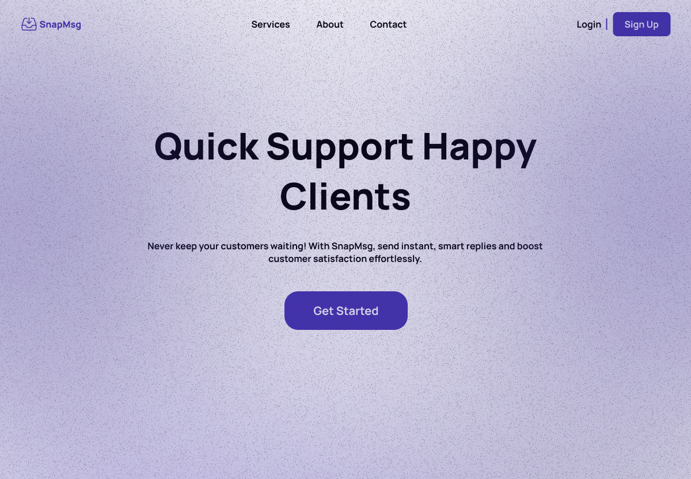

# read.me

A powerful Software-as-a-Service (SaaS) called SnapMsg a platform designed to intelligently respond to customer inquiries and general business queries, offering seamless integration with existing communication channels to streamline support, improve response times, and enhance overall customer experience.





# How to integrate

unregistered endpoint 

no company context or details

but can still be integrated for business response
```bash
https://snapmsg.vercel.app/response/client/${prompt}
```

sample response
```bash
{token:remaining_token, data:response}
```

registered end point

does have context and details of the company

can personalize customer response

```bash
https://snapmsg.vercel.app/response/${client-id}/${prompt}
```

sample response
```bash
response
```
## Tech Stack

**Client:** React, React Query, TailwindCSS

**Server:** Next.js, Supabase


## Authors

- [@japoy134](https://github.com/japoy143)

linkedin
- [rainier lesondato](https://www.linkedin.com/in/rainierlesondato/)
